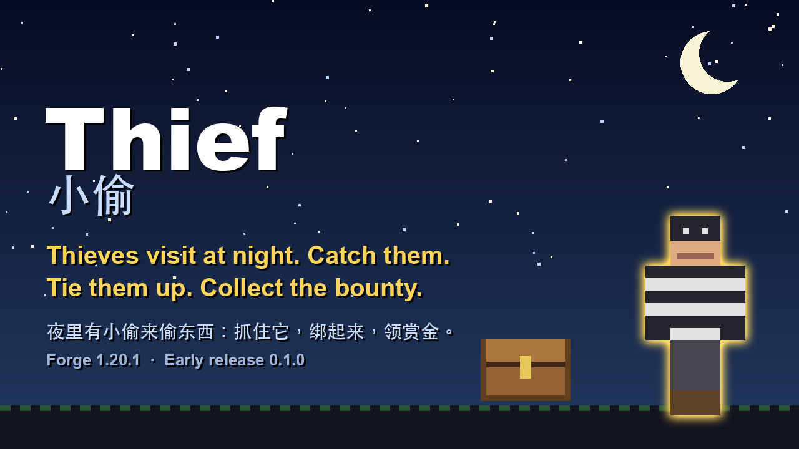

# 小偷 · Thief

[English](README.md) · [简体中文](README.zh-CN.md)



*（用模组自己的贴图拼的宣传图，不是游戏截图。）*

**夜里有小偷来偷东西：抓住它，绑起来，领赏金。**

一个 Minecraft **Forge 1.20.1** 模组。每到黄昏，可能有小偷来偷你的箱子、木桶和成熟的庄稼。它抓了就跑，发光几秒。你可以挂钟、养狗、装铁门，也可以追上去用绳子绑住，牵到悬赏榜换绿宝石。

有时来的是一整个**团伙**，有望风的，你一靠近他就吹口哨。偶尔团伙里还有一个**魔术师**。

| | |
|---|---|
| Minecraft | 1.20.1 |
| 加载器 | Forge 47.x（不需要别的模组） |
| 运行端 | 客户端和服务器都必须安装 |
| 许可 | MIT |
| 版本 | 0.1.0 —— **早期版本** |

> **状态。** 已经完整玩过，有自动测试（无界面的游戏内测试）覆盖，但还年轻。遇到奇怪的地方请提 issue。
>
> **AI 声明。** 本项目的代码、文案和图片由 AI（Claude）协助制作。

## 目录

- [小偷](#小偷) · [抓人](#抓人) · [工具](#工具) · [命令](#命令) · [配置](#配置) · [安装](#安装) · [从源码构建](#从源码构建) · [已知的限制](#已知的限制) · [许可](#许可)

## 小偷

| | |
|---|---|
| **小偷** | 每个黄昏每位玩家有 35% 的概率来一个（其中 25% 是团伙）。偷箱子和木桶里最多 3 组（每组最多 16 个）、成熟庄稼最多 8 棵（补种回去），然后**发光 20 秒**逃跑。上了陷阱的箱子、潜影盒、别的模组的存储它不碰；`mobGriefing` 关掉时什么也不偷；玩家 128 格内才活动。 |
| **它怕** | 你靠近 7 格内；狼和狗（驯服的也算）12 格内；**铁门**拦得住它，木门拦不住；箱子 5 格内挂**钟**，被偷时会响，48 格内的玩家都会收到消息，小偷只能偷 1 组。 |
| **团伙** | 两个盗贼加一个望风的。**望风的**在你 24 格内吹口哨，团伙撤退 10 秒；被追的**盗贼**把赃物整个交给同伙，自己发光当诱饵：看它手里拿什么，或用追踪器。他们跑得和你走路一样快（4.3 格/秒），疾跑能追上。 |
| **赎金与解救** | 抓到团伙里一个人后 10 到 20 秒，会有同伙举牌出来谈：空手（不潜行）放人，归还赃物的 70%，窗口 60 秒。打它一下谈判取消。没谈拢的话，同伙会来割绳子，你在 7 格内他们就不敢。 |
| **魔术师** | 三人以上的团伙有 40% 带一个。它不偷东西，40 点血，紫色血条。24 格内每 20 秒做最多 3 个**分身**（10 秒，一碰就变烟，真身是会疼、有血条的那个）；**隔空取** 14 格内箱子里的东西（每秒一组，换成道具）；**扔扑克牌**（2 点伤害，盾牌能挡）；放**烟雾**（失明减速 3 秒）并换位。它带 2 瓶药水，喝了**伪装**成动物、村民或人形生物 60 秒。血量打到三分之一以下，绳子才绑得住。掉落徽章和 3 个绿宝石。 |

## 抓人

- **绑**：用**绳子**右键。它不再跑也不再偷，跟着你走，不用打。空手（不潜行）右键放人，绳子还给你。
- **牵着**再用绳子对着：原木、栅栏、墙、柱子的侧面（**绑在树上**，一面只能一个人）；方块底面（**吊起来**，下面要有 3 格空位）；**刑架**（绑开）。弄掉上面的方块，或者刑架的任何一块，它就掉下来脱身。
- **搜身**（潜行 + 右键）一次一件，或者用**皮鞭**抽：打不死，35% 招供，说出别的自由小偷的位置（它们发光 30 秒）。
- **记仇**：被绑越久越恨：靠树每秒 +1，牵着 +0.5，吊起来或在架子上 +2，每鞭 +12，搜身 +3。到 30 冒烟，到 60 冒生气的粒子。放它时怨恨到 30 以上，要么攻击绑它的人 30 秒，要么跑得更快一分钟。
- **悬赏榜**：牵着被绑的小偷右键榜：单个 3 绿宝石，团伙成员 5，魔术师 10 加徽章，还有经验、绳子和剩下的赃物。
- 僵尸、尸壳、骷髅、村民、掠夺者、女巫、猪灵等人形生物也能绑（不能绑玩家），可在 `bindableTypes` 增减。

## 工具

| 物品 | 配方 |
|---|---|
| **绳子** | 6 根线斜着摆，得 2 根 |
| **皮鞭** | 木棍 + 2 线 + 皮革 |
| **刑架** | 4 原木 + 2 木棍 + 1 绳子；放在宽 3 高 3 的平地上 |
| **悬赏榜** | 3 木板在上；木板、纸、木板；下面一根木棍（2 × 2 的海报） |
| **小偷追踪器** | 指南针 + 望远镜：显示最近的带赃物小偷的方向、距离和最后出现的位置（赃物被交出去时会跟着赃物） |
| **小偷指南** | 书 + 线；第一次进世界会送你一本（`giveGuide`） |
| **魔术师徽章** | 魔术师掉落，或活着送到榜上；榜上换 8 绿宝石 |

## 命令

`/thief ledger`：失窃记录（人人可用）。管理员：`/thief visit`（派小偷来偷你附近的东西）、`crew`、`magician`、`spawn`、`debug`（看小偷为什么不动、赎金为什么没出价）。

## 配置

`config/thief-common.toml`，共 41 项，每项都有注释。一部分如下：

| 配置项 | 默认值 | 说明 |
|---|---|---|
| `nightlyChance` | `0.35` | 每个黄昏、每位玩家来小偷的概率 |
| `crewChance` | `0.25` | 来的是团伙的概率 |
| `magicianChance` | `0.4` | 团伙里有魔术师的概率 |
| `stacksPerTheft` / `maxItemsPerStack` / `cropsPerTheft` | `3` / `16` / `8` | 偷多少 |
| `bellRadius` | `5` | 钟要多近 |
| `crewSpeed` | `0.275` | 团伙的速度 |
| `ransomChance` / `ransomShare` | `0.7` / `0.7` | 出赎金的概率、归还的比例 |
| `bountyEmeralds` / `bountyCrewBonus` / `bountyMagician` / `tokenEmeralds` | `3` / `2` / `10` / `8` | 奖励 |
| `magicianCopySeconds` / `magicianCastSeconds` / `magicianTieHealth` | `10` / `20` / `0.35` | 魔术师的分身和绳子何时绑得住 |
| `disguiseEnabled` / `potions` / `disguiseSeconds` | `true` / `2` / `60` | 魔术师的伪装 |
| `giveGuide` | `true` | 要不要送指南书 |

## 安装

1. 安装 **Minecraft 1.20.1** 和 **Forge 47.x**。
2. 把 `thief-forge-1.20.1-0.1.0.jar` 放进 `mods` 文件夹（服务器也要放）。
3. 在附近有箱子的世界里试试 `/thief visit`。

## 从源码构建

需要 Java 17。

```sh
./gradlew build                  # build/libs/thief-forge-1.20.1-<版本>.jar
./gradlew runGameTestServer      # 自动化的游戏内测试（无界面）
./gradlew runClient
```

> `gradle.properties` 里有一行 `org.gradle.java.home=...`，指向作者 Mac 上 Homebrew 装的 Java 17。你的 Java 在别处的话，请改掉或者删掉这一行。

代码在 `src/main/java/com/xiaofeiwu/thief`（小偷是 `ThiefEntity`，夜间来访是 `NightVisits`，偷东西是 `StealGoal`）；测试是 `ThiefGameTests`。

## 已知的限制

- 没有和别的、自己也加小偷或偷箱子的模组一起测试过。
- 少数几条自动测试偶尔、很少地失败过，原因还没找到。

## 许可

[MIT](LICENSE)。Minecraft 和 Forge 归各自的所有者；这是一个非官方模组，与 Mojang 和微软无关。
